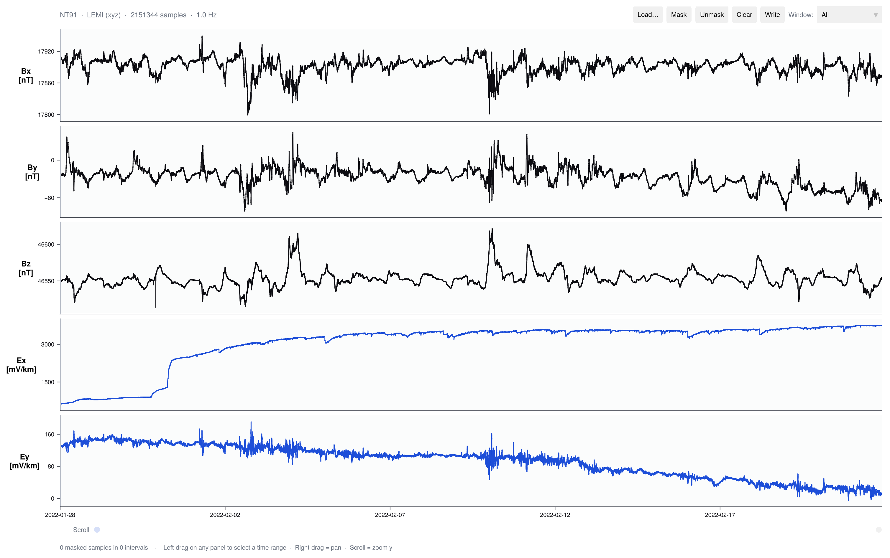

# Timekeepers.jl

Time-series IO and interactive inspection for magnetotelluric field data.

Timekeepers reads logger-native files into `TimeSeries.jl` `TimeArray`s, keeps
native writer paths for supported instruments, and ships **TKApp**, a native
GLMakie window for fast visual inspection and masking of long records.



A five-channel LEMI record after a few intervals were masked in TKApp, written
out, and reloaded — masked windows render as gaps in the traces.

Supported native formats:

- LEMI-424 long-period ASCII text files (24-column)
- GEOMAG-02 ASCII text files with semicolon headers
- Metronix ADU (ATS binary + XML) site directories
- Generic LEMI-style `.xyz` exports (7-column `date time Bx By Bz Ex Ey`)

## Installation

```julia
pkg> activate .
pkg> instantiate
```

TKApp uses GLMakie, so you need a desktop session with OpenGL 3.3+ drivers.
Quick smoke test — if this opens a window, `run_tkapp()` will too:

```julia
using GLMakie
display(scatter(1:10))
```

Headless SSH, WSL, containers, and very old GPUs may need extra OpenGL setup.

## Getting test data

Sample data is **not** shipped with the repository; the `data/` directory is
gitignored so you can drop large recordings in without polluting the repo. For
a quick test, download a public LEMI-424 dataset from the British Geological
Survey accession and extract the `.txt` into `data/`:

> https://webapps.bgs.ac.uk/services/ngdc/accessions/index.html#item182849

## Quick Start

Open the explorer window:

```julia
using Timekeepers
run_tkapp()
```

or run the bundled launcher script:

```powershell
julia --project=. examples/tkapp.jl
```

The toolbar covers the workflow: **Load** a file (or site directory), pick a
**Window** length and scroll through the record, **left-drag** to select an
interval, **Mask** / **Unmask** / **Clear** to edit it, and **Write** to
export. Masked rows are written as `NaN` in the original format alongside a
mask file of the intervals. The `View:` menu adds per-channel PSD and
spectrogram panels.

The same workflow from Julia code:

```julia
using Timekeepers, Dates

# Load
ta = first(Timekeepers._load_data_file("data/LEMI090.txt"))   # → TimeArray

# Mask
mask = TimekeeperMask(ta)
mask_interval!(mask, DateTime(2020, 10, 4, 0, 10), DateTime(2020, 10, 4, 0, 20))

# Derive processing-ready outputs
cleaned  = cleaned_timearray(ta, mask)                # NaN in masked rows
segments = good_segments(ta, mask; min_samples = 256) # contiguous good chunks
weights  = sample_weights(mask)                       # for robust processing

# Write (same format as loaded)
write_lemi424("data/LEMI090_clean.txt", cleaned)
write_mask("data/LEMI090_mask.csv", mask)
```
