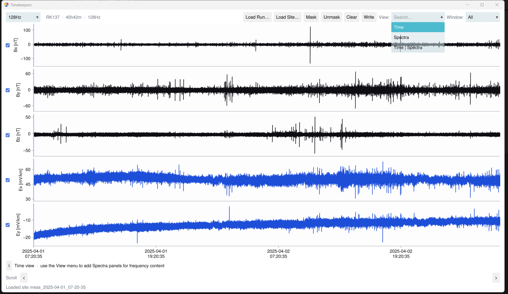
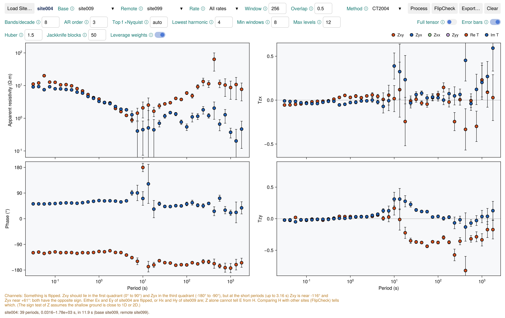

<div align="center">

  # Timekeepers.jl

  *Timeseries analysis in Electromagnetic Geophysics*

  [](https://JuliaGeophysics.github.io/Timekeepers.jl/dev)
  [](https://github.com/JuliaGeophysics/Timekeepers.jl/actions/workflows/CI.yml)
  [](LICENSE)
</div>

Timekeepers reads LEMI-424, GEOMAG-02 and Metronix ADU recordings into
[TimeSeries.jl](https://github.com/JuliaStats/TimeSeries.jl) `TimeArray`s. It
also writes each of these formats. It has three windows:

- **TKDash**, a survey dashboard to select base and remote sites;
- **TKApp**, a GLMakie window to examine, mask and clean long records;
- **TKProc**, a window to estimate transfer functions (experimental).

<p align="center">
  
  
  
</p>

## Installation

Timekeepers needs Julia 1.12 or newer. The package is not registered yet.
Thus, add it from GitHub:

```julia
pkg> add https://github.com/JuliaGeophysics/Timekeepers.jl
```

TKApp needs a desktop session with OpenGL 3.3 or newer. All the other
functions operate without a display.

## Quick start

```julia
using Timekeepers
run_tkapp()                                   # open the explorer window
```

For a full survey, **TKDash** shows when each site recorded. For the site that
you select, it shows the base sites (they recorded with it, near it) and the
remote sites (they recorded with it, far from it). It exports these sites for
each site:

```julia
run_tkdash("path/to/survey")                  # or: julia --project=. examples/tkdash.jl <dir>
```

You can also use code:

```julia
using Timekeepers, Dates

ta   = load_lemi424("data/LEMI090.txt")
mask = TimekeeperMask(ta)
mask_interval!(mask, DateTime(2020, 10, 4, 0, 10), DateTime(2020, 10, 4, 0, 20))

write_lemi424("data/LEMI090_clean.txt", cleaned_timearray(ta, mask))
write_mask("data/LEMI090_mask.csv", mask)
```

## Documentation

<https://JuliaGeophysics.github.io/Timekeepers.jl/dev>

## Contributing

We accept issues and pull requests. Refer to [CONTRIBUTING.md](CONTRIBUTING.md).
