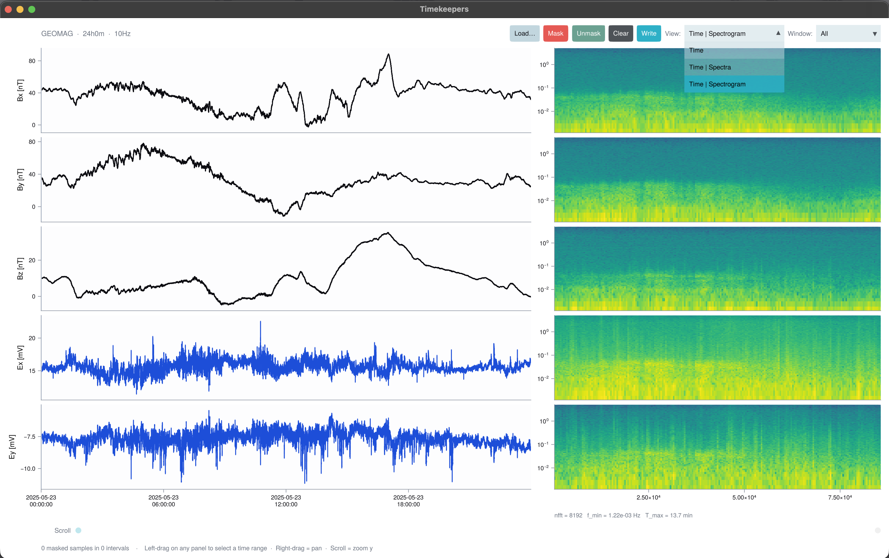

# Timekeepers.jl

*Time-series I/O and interactive inspection for magnetotelluric and geomagnetic field data.*

Timekeepers.jl reads logger-native recordings into
[TimeSeries.jl](https://github.com/JuliaStats/TimeSeries.jl) `TimeArray`s, keeps
a native writer for every format it reads, and ships **TKApp** — a GLMakie
window for scrolling through long records, marking bad intervals, and writing
the result back out in the instrument's own format.

It is part of the [JuliaGeophysics ecosystem](https://github.com/JuliaGeophysics)
and is designed to sit in front of a processing chain: get the raw record onto
screen, cut the noise out of it, and hand clean segments to whatever comes next.



A five-channel LEMI-424 record after a few intervals were masked in TKApp,
written out and reloaded — masked windows render as gaps in the traces.

## Features

- **Three instrument formats, read and write** — LEMI-424 long-period ASCII,
  GEOMAG-02 ASCII, and Metronix ADU (ATS binary plus XML sidecar). Auxiliary
  columns survive a round trip, so a file that goes through Timekeepers comes
  back out in the layout its acquisition software expects. See
  [Instrument Formats](formats.md).
- **Whole-site loading** — point at a directory and every run in it is read,
  ordered and concatenated with gaps filled, so a month of hourly files becomes
  one continuous series.
- **A mask model, not a destructive edit** — [`TimekeeperMask`](@ref) records
  bad intervals alongside the data. From it you can derive a `NaN`-filled
  series, contiguous good segments, or per-sample weights, and the mask itself
  is saved as a small CSV you can replay later. See
  [Masking & Cleaning](masking.md).
- **Interactive inspection** — [`run_tkapp`](@ref) opens a native window with a
  scrolling time-series view, drag-to-select masking, and optional per-channel
  PSD panels. See [TKApp Explorer](tkapp.md) and [Spectral Views](spectra.md).
- **Metronix site surgery** — split a mixed-rate site by sampling rate, then
  amputate masked intervals into clean per-segment `meas_*` directories with a
  written audit trail. See [Metronix Sites](metronix.md).

## Installation

```julia
pkg> add Timekeepers
```

Requires Julia 1.10 or newer. GLMakie is a hard dependency, so TKApp needs a
desktop session with OpenGL 3.3 or newer drivers — see
[Getting Started](getting_started.md#Checking-your-OpenGL-setup) for a smoke
test.

## Quick start

Open the explorer on a file:

```julia
using Timekeepers
run_tkapp("data/LEMI090.txt")
```

Or drive the same workflow from code:

```julia
using Timekeepers, Dates

# Read a run and convert to a TimeArray
run = read_timekeeper("data/LEMI090.txt")
ta  = to_timearray(run)

# Mark a bad interval
mask = TimekeeperMask(ta)
mask_interval!(mask, DateTime(2020, 10, 4, 0, 10), DateTime(2020, 10, 4, 0, 20))

# Derive processing-ready outputs
cleaned  = cleaned_timearray(ta, mask)                # NaN in masked rows
segments = good_segments(ta, mask; min_samples = 256) # contiguous good chunks
weights  = sample_weights(mask)                       # for robust processing

# Write back out in the source format, plus the mask itself
write_lemi424("data/LEMI090_clean.txt", cleaned)
write_mask("data/LEMI090_mask.csv", mask)
```

## Getting test data

Sample recordings are not shipped with the package. For a quick test, download
a public LEMI-424 dataset from the British Geological Survey accession and
extract a `.txt` file into your working directory:

> <https://webapps.bgs.ac.uk/services/ngdc/accessions/index.html#item182849>

## Citing

If Timekeepers.jl is useful in published work, please cite the repository:
<https://github.com/JuliaGeophysics/Timekeepers.jl>.
