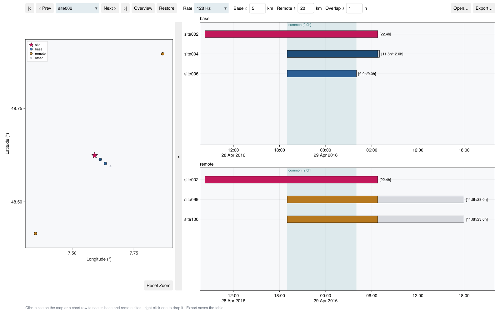

# TKDash Survey Dashboard

To process a magnetotelluric site with other sites, you must know which sites
recorded **at the same time and at the same sampling rate**. You must also
know their distances. TKDash scans a survey directory and shows this data for
one site at a time:

- the **site** in focus;
- its **base** sites: sites that recorded with it, within a distance that you
  select (for interstation processing);
- its **remote** sites: sites that recorded with it, beyond a second, larger
  distance (for remote-reference processing).



## Open the dashboard

!!! tip "Tutorial data"
    For a survey to try, download the public Metronix tutorial data of BRGM:
    <https://github.com/BRGM/razorback-tutorial-data>. The data has six sites
    near Strasbourg that recorded at 128 Hz at the same time. The screenshot
    on this page uses this data.

```julia
using Timekeepers

dash = run_tkdash("data/survey")       # blocks until the window closes
write_reference_plan("plan.txt", dash) # the choices made in the window survive the session
```

If you do not give a path, [`run_tkdash`](@ref) opens a folder dialog. A
launcher accepts the survey directory as its argument:

```bash
julia --project=. examples/tkdash.jl /path/to/survey
```

One survey can contain Metronix, LEMI-424 and GEOMAG sites together. The scan
reads **only the headers**: the `.ats` headers of a Metronix site, and the
first and the last lines of LEMI-424 and GEOMAG files. Thus, a large survey
opens in one or two seconds.

- A site is a directory that holds Metronix `meas_*` directories or LEMI-424
  or GEOMAG files.
- The scan looks four levels deep in directories that are not sites.
- The scan ignores the rate directories of a site (`site002.128` next to
  `site002`). Thus, it does not count a site two times.

## The window

The window has the layout of the data dashboard of MTGeophysics:

1. a header;
2. the map;
3. a thin button that collapses the map;
4. the charts.

| Control | What it does |
|:---|:---|
| **\|< · < Prev · site · Next > · >\|** | Go through the sites, or select one |
| **Overview** | Go back to the full survey, with no site in focus |
| **Restore** | Bring back the sites that you dropped for the site in focus. In the overview, bring back all the dropped sites |
| **Rate** | The menu gives each sampling rate in the survey. Only runs at the selected rate make pairs. `All rates` makes a pair of two sites that record at the same time, at all rates (for surveys with LEMI, GEOMAG and Metronix sites). The survey opens at 128 Hz if a site recorded at that rate |
| **Base ≤** | Sites that record with the site within this distance (km) are base sites |
| **Remote ≥** | Sites that record with the site at this distance (km) or more are remote sites. Sites between the two distances are neither |
| **Overlap ≥** | Sites that record with the site for less than this time (hours) are neither |
| **Open…** | Scan a different directory |
| **Export…** | Write the base and remote sites of each site as a text table (refer to the subsequent section) |

The site menu shows each site in navy. When the survey is long, the menu
scrolls. When you type in the menu, it filters the list.

**Overview.** One chart shows all the runs of all the sites, with one row for
each site. The recording hours of each site show at the end of its bar. The
runs at other rates are faint. The map shows all the sites.

**A site in focus.** Click a site on the map or a row of a chart, or go to
it with the header buttons. Then all the views use that site:

- The map shows the site as a **magenta star**, its base sites as **blue**
  circles and its remote sites as **amber** circles. A circle is darker when
  its site recorded with the site for a longer time. The other sites stay as
  small grey dots. A legend gives the names of the markers.
- The charts become two: **base** (the site above its base sites) and
  **remote** (the site above its remote sites). The time that each site
  recorded with the site has the color of that site.
- At the end of each bar, `[1.5h/9.5h]` gives the hours that a base or remote
  site recorded with the site, then its own hours. The row of the site shows
  `[22.4h]`.
- The charts show only the five best base sites and the five best remote
  sites.

**Common window.** A light teal band, with the label `common [9.0h]`, shows
the time when the site and *all* the base and remote sites that it keeps
recorded together. Processing can use this part with all of them at the same
time. The band includes all the kept sites, also the sites after the first
five. Thus, if you drop a site that recorded only for a short time, the band
becomes wider. [`common_window`](@ref) calculates the band in code.

**Hover.** Put the pointer on a site on the map or on a row of a chart. A
tooltip then shows:

- the name of the site;
- its role and its distance from the site in focus;
- the hours that it recorded with the site, and its own hours;
- its channels;
- on a bar, the file, the rate and the time span of the run.

**Electric-only sites.** Base and remote sites give their magnetic field.
Thus, only sites that recorded Hx and Hy can be base or remote sites. A
telluric site has only electric channels. A telluric site can be the site in
focus, and it then uses the magnetic fields of its base and remote sites. Its
chart rows show `site003 · E only`. For LEMI-424 and GEOMAG files, a channel
that is zero or blank at the two ends of the file is not a recorded channel.

**Drop a site.** Right-click a base or remote site, on the map or on a chart,
to drop it from the lists of the site. For example, drop a site with a
defective sensor. A dropped site leaves the comparison:

- It goes out of the charts, and the next best site takes its position.
- It does not make the common window narrower.
- It is not in the export.

The dropped site stays on the map as a hollow circle. Right-click it there to
bring it back. Or push **Restore** to bring back all the sites that you
dropped for the site in focus. Each site keeps its own dropped sites.

The line below the charts tells you what to do, in grey. It shows each drop,
scan and export in cyan. It shows each failure in red.

**Zoom.** The map keeps the shape of the survey at true scale. It becomes
larger with the window.

- Scroll on the map to zoom.
- Drag a box with the left button to zoom to the box.
- Drag with the right button to pan.

These functions help when a remote site is far and the base sites are near
each other. The zoom stays when you go to a different site. The **Reset
Zoom** button below the map shows the full survey again and resets the
charts. Scroll on a chart to zoom its time axis. The `‹` button collapses the
map and gives the full width to the charts.

## The plan file

**Export…** and [`write_reference_plan`](@ref) write a plain text table. The
table has one header line and one row for each site. The columns are
aligned:

```
site      base                        overlap (h)          remote                                        overlap (h)
site002   site004, site006            11.77, 9.00          site099, site100                              11.77, 11.77
site004   site009, site002, site006   11.87, 11.77, 9.00   site099, site100                              12.00, 12.00
site099   -                           -                    site100, site004, site009, site002, site006   22.98, 12.00, 11.87, 11.77, 9.00
```

The base and remote sites are in order of **longest overlap first**. Thus,
the first site is the best site. Each `overlap (h)` column gives the hours of
these sites with the site, in the same order. A `-` shows an empty list. The
table holds all the base and remote sites that the site keeps, not only the
five that the window shows.

[`read_reference_plan`](@ref) reads the table. It gives one
`(site, base, base_hours, remote, remote_hours)` for each row. Processing
steps that make pairs of a site with its base or remote sites can use this
data.

## Without the window

```julia
survey = scan_survey("data/survey")
survey["site004"]                                  # one site, its runs and position
refs = site_references(survey, "site004"; rate = 128, base_km = 5, remote_km = 20)
refs.base                                          # longest overlap first
overlap_intervals(survey["site004"], survey["site100"]; rate = 128)
write_reference_plan("plan.txt", survey; rate = 128, base_km = 5, remote_km = 20)
```

The scan uses the first line and the last line of a LEMI-424 or GEOMAG file
as the start and the end of the recording. Thus, the scan does not see a gap
in one file. To show such a gap, cut the record into files at the gap, or
examine the record in [TKApp](tkapp.md).
